# PCB

This directory contains the KiCad files for the radio adapter boards used by
the ESP32-C3 Radio project.

## Contents

- `module_radio.kicad_pro`, `module_radio.kicad_sch`, and
  `module_radio.kicad_pcb`: the main KiCad project.
- `*.kicad_sch`: schematic sheets for the individual radio modules.
- `Librarys/`: project symbols, footprints, and 3D models.
- `Pictures/`: board renders/images, shown below.
- `Gerbers/`: locally exported Gerber archives. This directory is treated as a
  generated artifact and is ignored by Git; public distribution should use
  release assets instead.

Local KiCad-generated files such as `fp-info-cache`, `*.kicad_prl`,
`untitled.kicad_sch`, and `desktop.ini` are ignored.

## Board Images

| Module | Image |
| --- | --- |
| Ai-Thinker-Ra-01 | 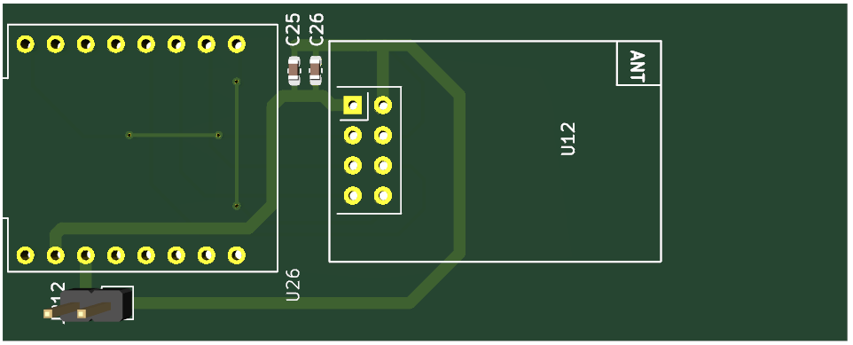 |
| Ai-Thinker-Ra-02 | 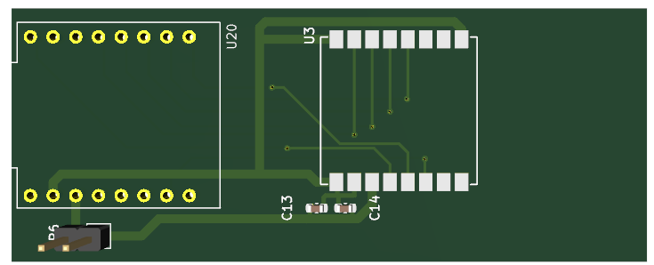 |
| CC1101 | 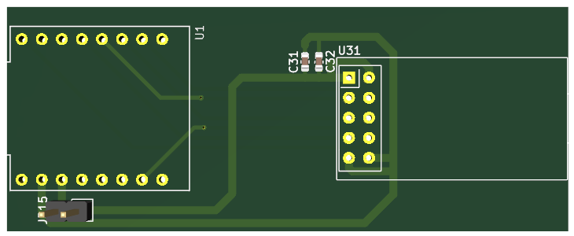 |
| E07_400M10S | 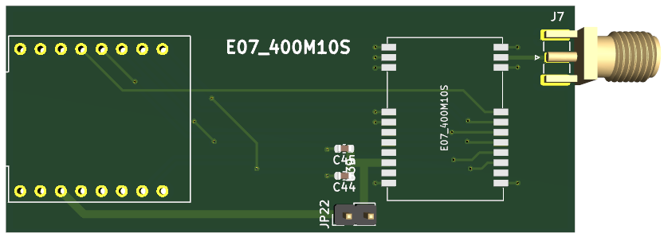 |
| E07_433M20S | 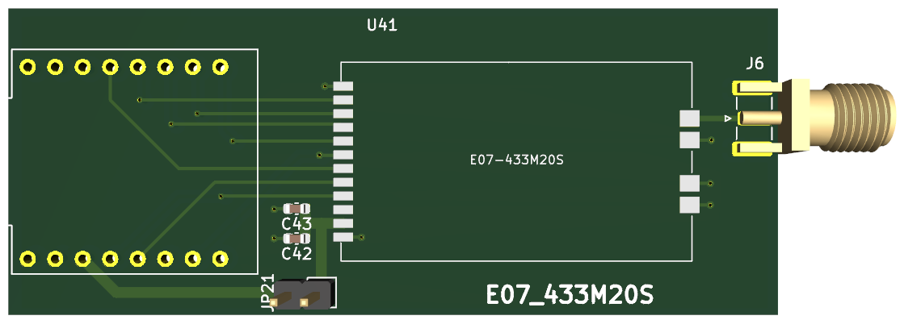 |
| E07_900MM10S | 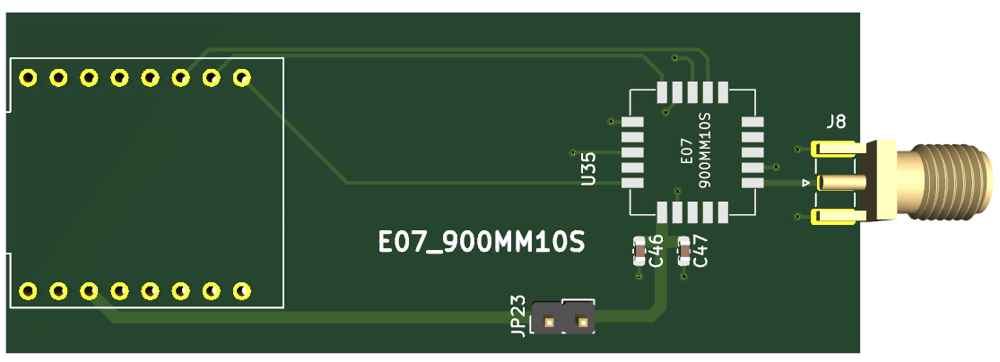 |
| E22 (SX1262) |  |
| E280 | 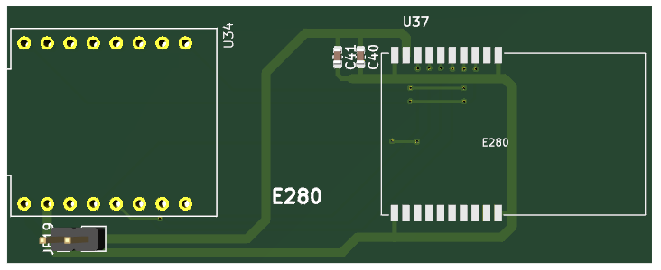 |
| E32-433T20D |  |
| E32-433T20D_V2 | 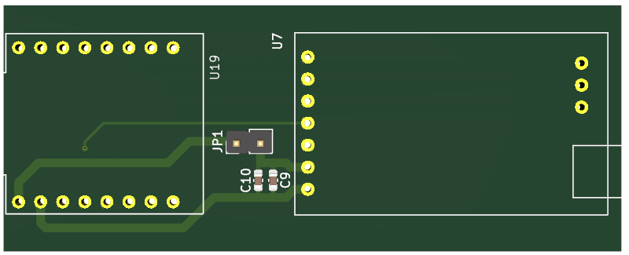 |
| E32-433T33D | 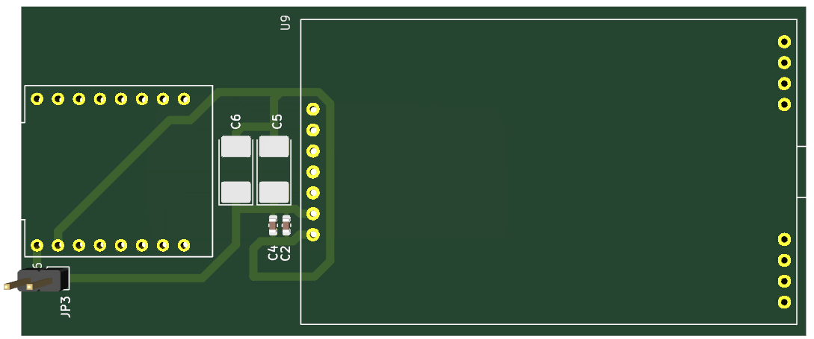 |
| E79-400DM2005S | 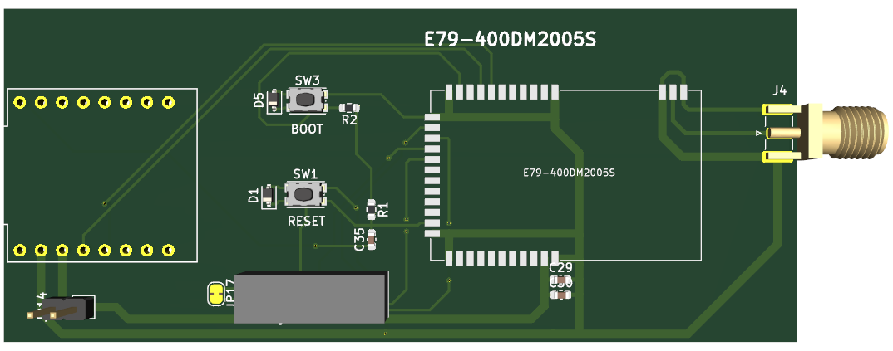 |
| E79-400DM2005S_V2.0 | 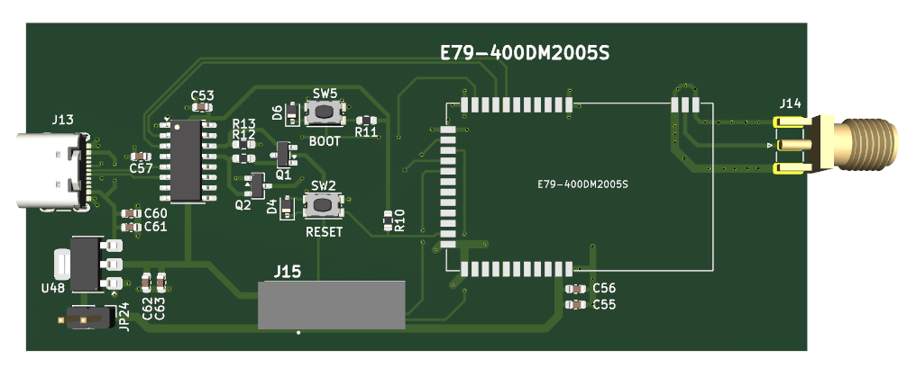 |
| Ebyte-E28 | 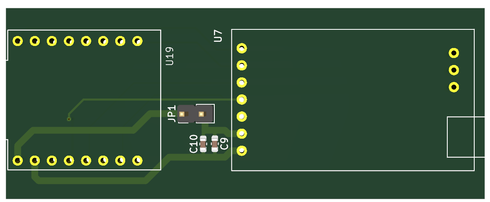 |
| Ebyte-E79 | 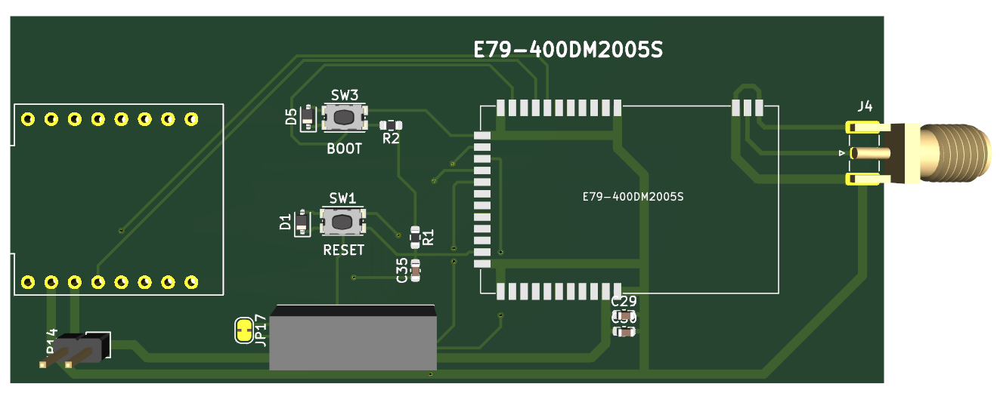 |
| HC-12 | 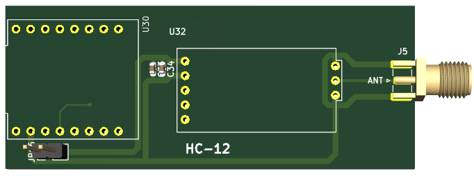 |
| NRF24L01 | 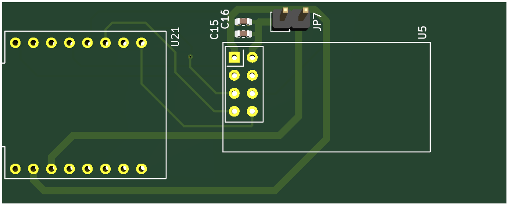 |
| nRF24L01-PA-LNA | 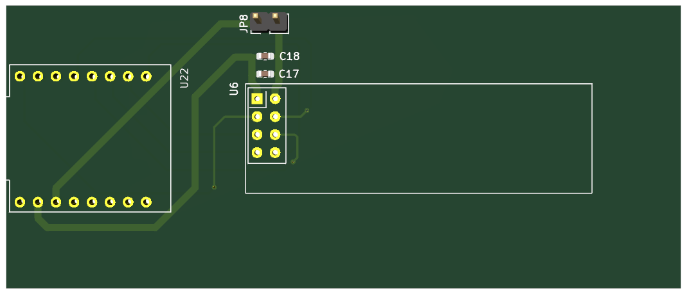 |
| RA-01 | 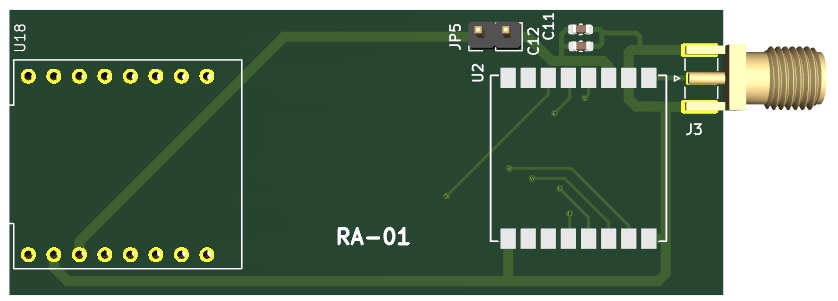 |
| RA-02 | 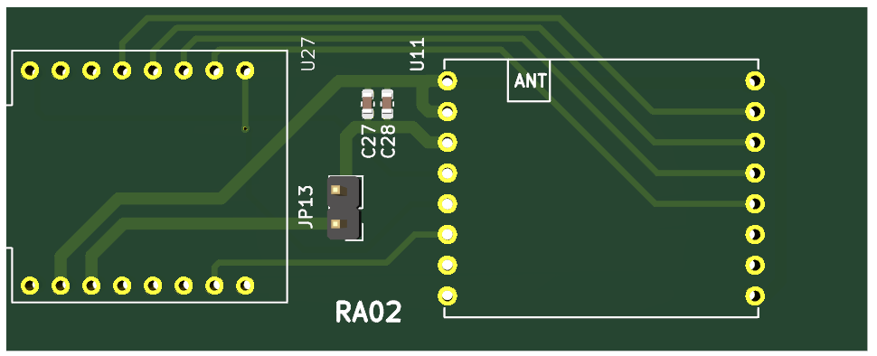 |
| RA-09 | 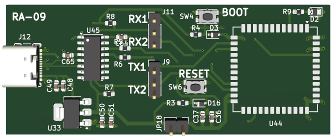 |
| RFM69HCW | 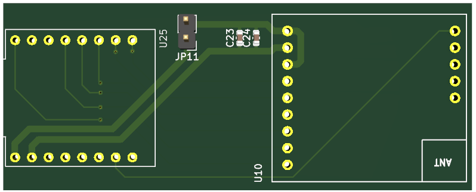 |
| SX127X | 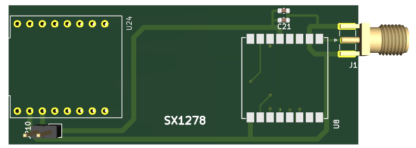 |
| TI-CC1101 | 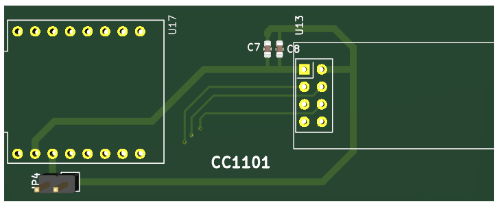 |
| XL1276-D01 | 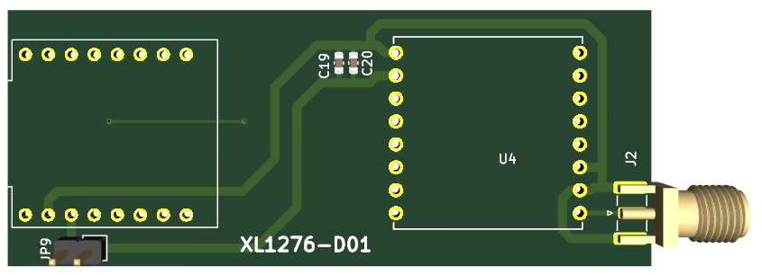 |

## Image Coverage Vs Gerbers

The comparison below uses the file name without extension:
`PCB/Gerbers/*.zip` vs `PCB/Pictures/*.png`.

Current local summary:

- Gerbers: 25 `.zip` archives.
- Images: 25 `.png` files.
- Exact name matches: 25.

Gerbers without an image using the same name:

None at the moment.

Images without a Gerber archive using the same name:

None at the moment.
